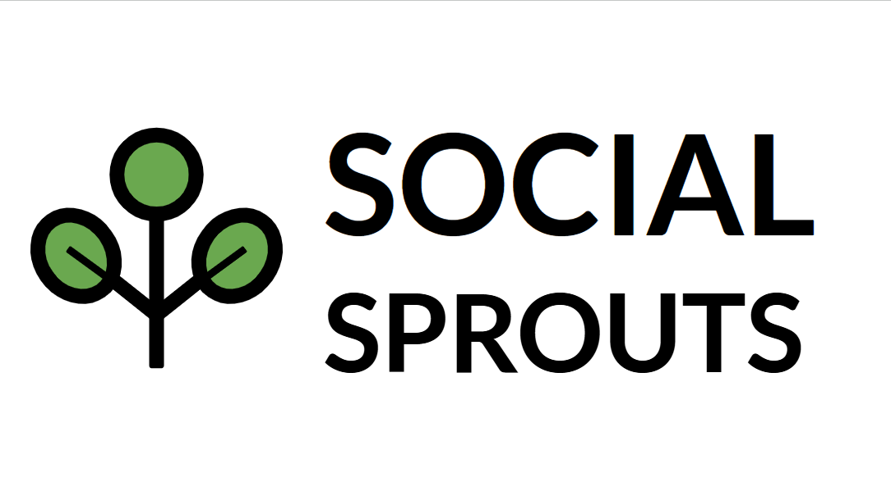

<h1 align="center">



  
</h1>
  
<h1 align="center">

Social Sprouts - Aplicación para el apoyo a la integración social de niños con TEA

</h1>

El Trastorno del Espectro Autista (TEA) está compuesto por un conjunto amplio de
alteraciones que afectan al neurodesarrollo, entre los que se encuentran déficits persis-
tentes en comunicación, interacción social y reciprocidad socioemocional. Estas barreras
provocan que las personas que lo presentan tengan dificultades para comunicarse con su
entorno.
</br></br>
En este trabajo se propone diseñar y evaluar una aplicación gamificada de código libre con
el objetivo de mejorar las habilidades sociales de estos niños. En particular, se propone
mejorar su desempeño sociocomunicativo: expresión verbal, reconocimiento emocional y
predictibilidad y adaptación a nuevos entornos.
</br></br>
Los juegos aplicados a este objetivo están basados principalmente en lograr que el niño
aprenda mientras está entretenido, integrándolos en su rutina. El aprendizaje le facilitará
asociar imágenes o pictogramas, bien a un vocabulario verbal (de modo que se le facilite
la comunicación cuando no disponga de medios facilitadores como los Sistemas Aumen-
tativos y Alternativos de Comunicación “SAAC”) o a la idea de emociones y contextos
sociales (viajes, visitas médicas, eventos sociales, etc).

# Manual de instalación para Android

### 1.- Descargar la última versión de la APK publicada en este repositorio en el dispositivo Android que desee.
### 2.- Instalar la APK en el dispositivo (en caso de ser necesario, autoriza la instalación de aplicaciones de terceros).

# Manual de despliegue

El código de esta aplicación se generó empleando React Native sin un framework y son los pasos necesarios para implementar y lanzar la aplicación los que se describen a continuación. 

## 1.- [Configurar el entorno de desarrollo](https://reactnative.dev/docs/set-up-your-environment?platform=android&os=windows) acorde con lo que deseamos.
*En el caso de este proyecto serán necesarias las instalaciones de Node.js, Android SDK 34 y JDK 17.

## 2.- Descargar o clonar el código fuente
Si el código está en un repositorio, clónalo usando:  
```
       git clone <URL_DEL_REPO>
```

Luego entra en la carpeta del proyecto:  
```
       cd nombre-del-proyecto
```
       
## 3.- Instalar dependencias  
Ejecuta el siguiente comando para instalar las dependencias del proyecto:  
```
       npm install
```

## 4.- Iniciar Metro Bundler y ejecutar la aplicación
Asegúrate de tener un emulador corriendo o un dispositivo conectado con `adb devices`.

```
       npm run android
```

# Manual de usuario y desarrollador
El [Manual de usuario](https://github.com/DavidChGA/social-sprouts/wiki/manual-de-usuario) y el [Manual de desarrollador](https://github.com/DavidChGA/social-sprouts/wiki/manual-de-desarrollador) pueden ser consultados en sus respectivas páginas de la Wiki de este repositorio.

- En el Manual de usuario se describen las funcionalidades con las que cuenta la aplicación además de desarrollarse cómo navegar a través de sus pantallas e interactuar con los distintos elementos con los que se cuenta.

- En el Manual de desarrollador se describen los procesos para añadir recursos y configurar de manera automatizada el minijuego de Vocabulario y cómo añadir nuevos módulos de minijuego a la aplicación si se deseara.
